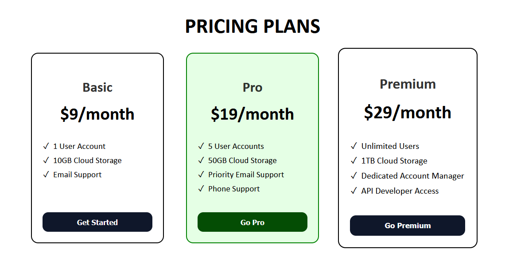

# Pricing Plans Layout

Projet d'entraînement réalisé dans le cadre du cursus freeCodeCamp.


Mise en page d'une grille de plans tarifaires construite avec HTML sémantique et CSS Flexbox.

---

## Aperçu

Trois cartes tarifaires (Basic, Pro, Premium) disposées en ligne avec Flexbox, chacune présentant son prix, ses fonctionnalités et un bouton d'appel à l'action.



---

## Démo en ligne

   **[Voir la démo en direct](https://docaridr.github.io/pricing-plans-layout-freecodecamp/)**

---

## Technologies

- HTML5 sémantique (`<main>`, `<article>`)
- CSS3 Flexbox
- Transitions CSS (`transform`, `background-color`)
- Pseudo-classe `:hover` et `:focus-visible`

---

## Structure du projet

```
pricing-plans-layout/
├── index.html
└── styles.css
```

---

## Lancer le projet en local

```bash
git clone https://github.com/DocariDR/pricing-plans-layout.git
cd pricing-plans-layout-freecodecamp
# Ouvrir index.html dans un navigateur
```

---

## Auteur

**DocariDR** - [GitHub](https://github.com/DocariDR)